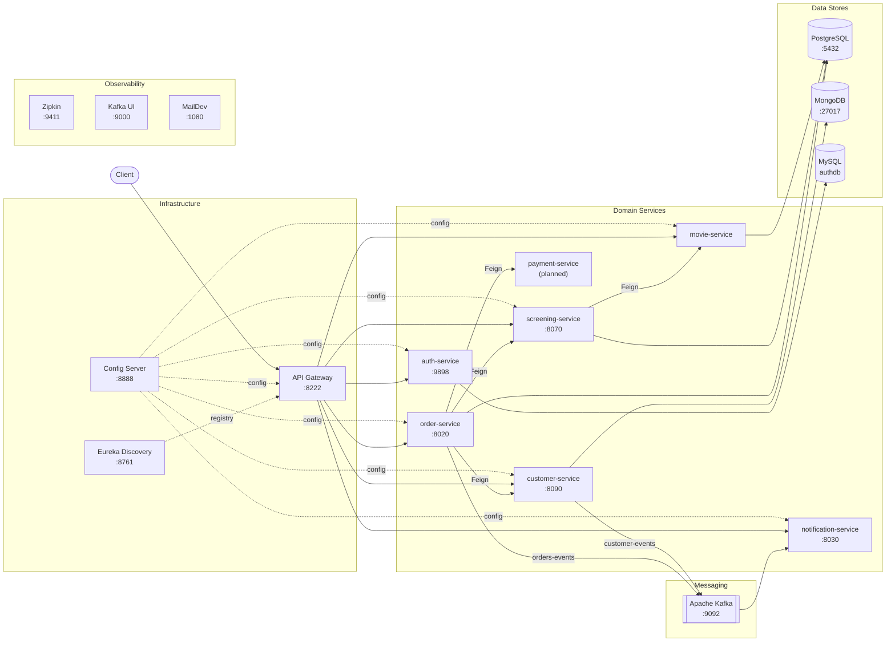
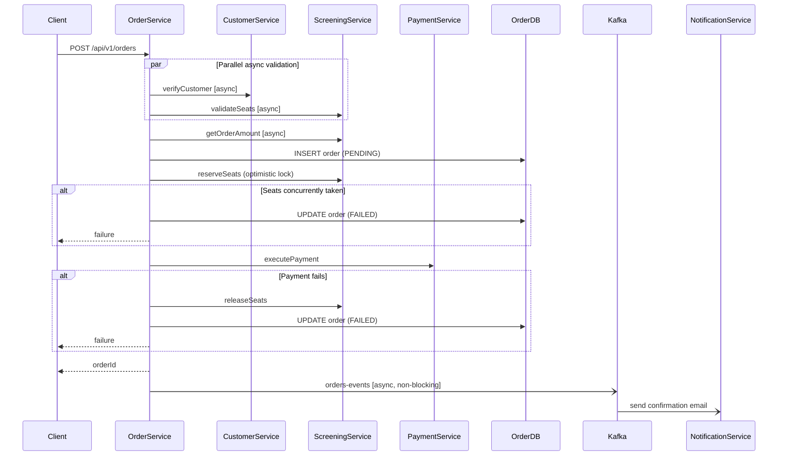

# TicketHub

TicketHub is a production-style **movie ticket sales and management** platform built on a microservices architecture. It demonstrates end-to-end distributed-systems engineering: domain service decomposition with dedicated per-service databases, synchronous inter-service communication via declarative Feign clients, asynchronous event publishing through Apache Kafka, centralized configuration and service discovery via Spring Cloud, and a multi-step order booking flow that combines parallel async validation, optimistic concurrency control on seat inventory, and compensating transactions on failure.

---

## Architecture



---

## Services

| Service | Port | Database | Responsibility |
|---|---|---|---|
| **config-server** | 8888 | — | Serves YAML configuration to every service at startup via Spring Cloud Config |
| **discovery** | 8761 | — | Netflix Eureka registry; services register here and the gateway resolves `lb://` routes |
| **gateway** | 8222 | — | Single entry point for all clients; routes by path prefix to downstream services via Eureka load balancing |
| **auth-service** | 9898 | MySQL | User registration, password hashing (BCrypt), JWT issuance and validation (HS256, 30-min expiry) |
| **customer-service** | 8090 | MongoDB | Customer profile CRUD; publishes `CustomerEvent` to Kafka on create / update / delete |
| **movie-service** | — | PostgreSQL | Movie catalog management; exposes an `exists` endpoint consumed by screening-service |
| **screening-service** | 8070 | PostgreSQL | Showtime and seat inventory management; uses JPA `@Version` for optimistic locking on concurrent seat reservation |
| **order-service** | 8020 | PostgreSQL | Orchestrates the full ticket booking flow — validation, seat reservation, payment, Kafka event publishing |
| **notification-service** | 8030 | — | Kafka consumer; sends transactional emails on customer lifecycle events and order confirmations |
| **payment-service** | — | — | Planned; currently a Feign client interface stub in order-service |

---

## Tech Stack

| Technology | Role | Rationale |
|---|---|---|
| **Spring Boot 3 / Spring Cloud** | Application framework, Config, Discovery, Gateway, Feign | Mature, well-integrated ecosystem purpose-built for microservices patterns on the JVM |
| **PostgreSQL** | Persistence for order, screening, movie services | ACID transactions are non-negotiable for seat inventory and financial order records |
| **MongoDB** | Persistence for customer-service | Flexible document model suits an evolving customer profile schema without schema migrations |
| **Apache Kafka** | Async event bus | Durable, ordered, replayable — decouples notification delivery from the booking critical path; enables future event sourcing |
| **OpenFeign** | Synchronous HTTP clients | Declarative interface-based clients integrate natively with Eureka for client-side load balancing |
| **Netflix Eureka** | Service discovery | Services register by name; gateway and Feign clients resolve addresses at runtime without hardcoded URLs |
| **JWT (HS256)** | Stateless authentication | Tokens are self-contained and verifiable at the gateway without a DB round-trip |
| **JPA Optimistic Locking (`@Version`)** | Concurrent seat reservation | Lightweight compare-and-swap on the `Screening` row — no pessimistic locks held across network calls |
| **Spring `@Async` + `CompletableFuture`** | Parallel inter-service calls | Fan-out independent remote calls concurrently to reduce booking latency |
| **Zipkin** | Distributed tracing | Correlates traces across service boundaries to pinpoint latency and failures in production |

---

## Order Booking Flow

The order-service is the most complex domain service. It coordinates four downstream services — customer, screening, payment, and notification — while guaranteeing seat inventory consistency and providing a clear audit trail for every booking attempt. The implementation lives in [`OrderServiceV2`](services/order/src/main/java/com/yarin/common_dtos/order/OrderServiceV2.java).

### Flow Diagram



### Step-by-Step Walkthrough

**Step 1 — Parallel async validation**

```java
CompletableFuture<Boolean> isCustomerExist = verifyCustomer(customerId);
CompletableFuture<Boolean> areSeatsAvailable = verifySeats(screeningId, requiredSeats);

boolean customerExists = isCustomerExist.join();
boolean seatsAvailable = areSeatsAvailable.join();
```

Both `verifyCustomer` and `verifySeats` are annotated `@Async` and return `CompletableFuture<Boolean>`. They are launched concurrently before either result is awaited, so the two remote calls execute in parallel rather than sequentially. The `join()` calls collect results only after both are in flight, cutting the validation wall-clock time roughly in half compared to a sequential approach.

**Step 2 — Fail fast before writing state**

```java
if (!customerExists || !seatsAvailable) {
    return -1;
}
```

If either validation fails, the method returns immediately. No order row, no ticket row, no seat lock — the DB is never touched for an invalid request.

**Step 3 — Price calculation**

```java
CompletableFuture<BigDecimal> orderAmount = getOrderAmount(screeningId, requiredSeats);
```

The price fetch is also `@Async`. It is started after the validation gate, with a noted opportunity (captured in a TODO) to overlap it with the initial validation fan-out for further latency reduction.

**Step 4 — PENDING order persisted**

```java
Order order = createInitialOrder(customerId, orderAmount.join());
```

The order is written to the database in `PENDING` status before any seat is permanently reserved or payment is attempted. This creates an immutable audit record for every booking attempt — including those that will later fail — which is essential for debugging, support, and reconciliation.

**Step 5 — Optimistic seat reservation (two-phase check)**

```java
Boolean finalSeatsAvailability = screeningClient.reserveSeats(screeningId, requiredSeats).getBody();
if (Boolean.FALSE.equals(finalSeatsAvailability)){
    return handleOrderFailure(order, "Seat reservation failed");
}
```

The `Screening` entity carries a JPA `@Version` field. The reservation call on the screening-service performs an atomic compare-and-swap: if a concurrent request has modified the seat map since the initial `validateSeats` check, the optimistic lock detects the conflict and the reservation is rejected. This two-phase approach avoids holding a DB lock across the customer-service round-trip in step 1, keeping lock contention minimal.

**Step 6 — Payment with compensation**

```java
Boolean isPaymentSucceed = paymentClient.executePayment(customerId, orderAmount.join()).getBody();
if (Boolean.FALSE.equals(isPaymentSucceed)){
    return handlePaymentFailure(order, screeningId, requiredSeats);
}
```

On payment failure, `handlePaymentFailure` executes a compensating transaction: it calls `screeningClient.releaseSeats` to undo the reservation and then marks the order `FAILED`. The compensation is logged with the order ID, giving ops a clear trail to investigate and, if needed, manually reconcile.

**Step 7 — Non-blocking Kafka publish**

```java
createOrderCreatedEvent(customerId, order.getId(), order.getTotalAmount(), order.getOrderCode());
return order.getId();
```

`createOrderCreatedEvent` is `@Async`, so the HTTP response is returned to the client immediately. The Kafka message is dispatched on a separate thread-pool thread. This means a Kafka broker slowdown or outage does not degrade booking latency or cause booking failures.

**Step 8 — Error isolation in event publishing**

```java
try {
    CompletableFuture<String> customerFullName = customerClient.getCustomerFullName(customerId);
    CompletableFuture<String> customerEmail    = customerClient.getCustomerEmail(customerId);
    // ...
    kafkaTemplate.send(new ProducerRecord<>("orders-events", event));
} catch (Exception e) {
    log.error("Failed to publish OrderCreatedEvent for Order ID: {}", orderId, e);
}
```

Even the two async customer-detail fetches inside the event builder are parallelised with `CompletableFuture`. The surrounding `try/catch` guarantees that any failure in this path — network error, serialisation issue, broker unavailability — is absorbed and logged without any impact on the already-confirmed booking.

### Design Decisions Summary

> **Feature flag via `@ConditionalOnProperty`:** `OrderServiceV2` activates only when `order.service.with-publish=true`. `OrderServiceV1` (synchronous, no Kafka) is the default. This pattern allows safe, incremental rollout of the event-driven path while keeping the simpler implementation as a fallback — no code deletion required.

> **Two-phase seat check over single atomic lock:** Validating availability first (without reserving) and reserving only after all pre-conditions pass means the seat-row lock is held for the shortest possible window, reducing contention under high concurrency.

> **Explicit compensation over distributed transactions:** Rather than attempting XA/2PC across services, failures at each step trigger explicit compensating calls (`releaseSeats`, status update). Each compensation is logged, making the system auditable and operationally transparent.

---

## Running Locally

### Prerequisites
- Docker and Docker Compose
- Java 21
- Maven 3.9+

### Start infrastructure

```bash
docker-compose up -d
```

This starts MongoDB, PostgreSQL, Kafka (+ Zookeeper), Kafka UI, Zipkin, and MailDev. The config-server, discovery, gateway, and customer-service images are also built and started by Compose.

### Start remaining services

Start services in dependency order. Each service picks up its configuration from the config-server at startup.

```
config-server  →  discovery  →  gateway  →  (domain services in any order)
```

```bash
# Example: run each service from its directory
cd services/auth-service  && mvn spring-boot:run
cd services/movie         && mvn spring-boot:run
cd services/screening     && mvn spring-boot:run
cd services/order         && mvn spring-boot:run
cd services/notification  && mvn spring-boot:run
```

### Service endpoints

| URL | Description |
|---|---|
| `http://localhost:8222` | API Gateway — all client traffic enters here |
| `http://localhost:8761` | Eureka dashboard — registered service instances |
| `http://localhost:9000` | Kafka UI — inspect topics and messages |
| `http://localhost:9411` | Zipkin — distributed trace explorer |
| `http://localhost:1080` | MailDev — captured outbound emails |

### Activate the Kafka order flow (V2)

Set the following property in `order-service`'s configuration before starting it:

```yaml
order:
  service:
    with-publish: true
```

With this flag off (default), `OrderServiceV1` is active — a fully synchronous flow with no Kafka dependency.

---

## Roadmap

The following areas are designed and partially scaffolded but not yet fully wired:

| Area | Status |
|---|---|
| **Payment service** | Feign client and gateway route defined; service implementation not present |
| **`orders-events` consumer** | `OrderCreatedEvent` is published by V2; no Kafka consumer exists yet in notification-service |
| **`OrderSucceededEvent`** | Event record defined; not yet published or consumed |
| **Gateway JWT enforcement** | Auth-service issues and validates JWTs; gateway filter and resource-server wiring on downstream services is pending |
| **Screening seat REST endpoints** | Seat reserve/cancel endpoints are implemented in the service layer but commented out in the controller |
| **Ticket service extraction** | Tickets are currently managed inside order-service; a `ticket-service.yml` config exists for a future standalone service |
| **`OrderServiceV2.createOrder(OrderRequest)`** | The `OrderRequest`-based entry point currently returns a stub; the full async path is accessed via the overloaded signature |
